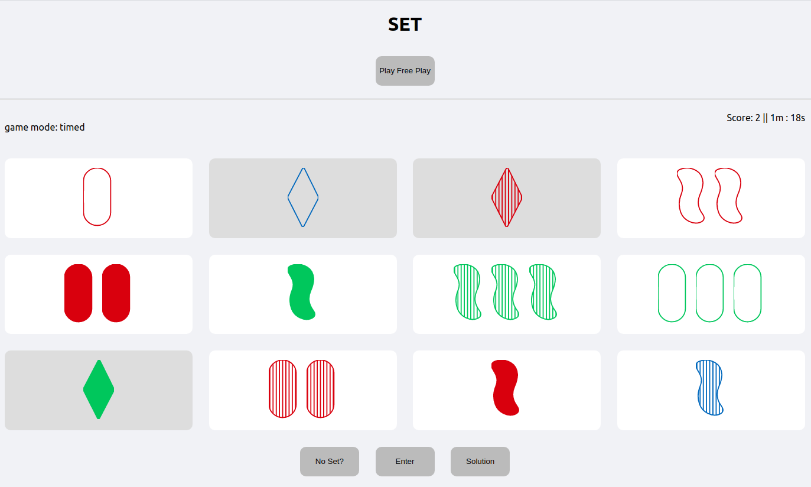

# Set Online

*readme last edited: 4/29/2020*

**This is a work in progress. Feel free to submit a PR ;)**

## Instructions

1. clone this repo
2. `npm start`
3. go to `localhost:3000`
4. contribute!

## How to play?

This is currently just a basic implementation of the game Set. You should look up instructions on what a "set" is / how to play.

There are two modes: free play and timed. In free play, select 3 cards and click enter. If it is a set, those 3 cards will be replaced. Pressing solution will print out the solution in the dev inspect console. If you press the no set button when there is no set, then 3 more cards will be shown. Timed is the same as free play, except I added a timer and score tracker.

## Acknowledgements

Thanks to Brent for helping me a lot, Cherry for helping me fix the UI (see screenshots 2 and 3 in the assets folder for what it used to look like), and Steven for the inspiration and motivation to create this game!

