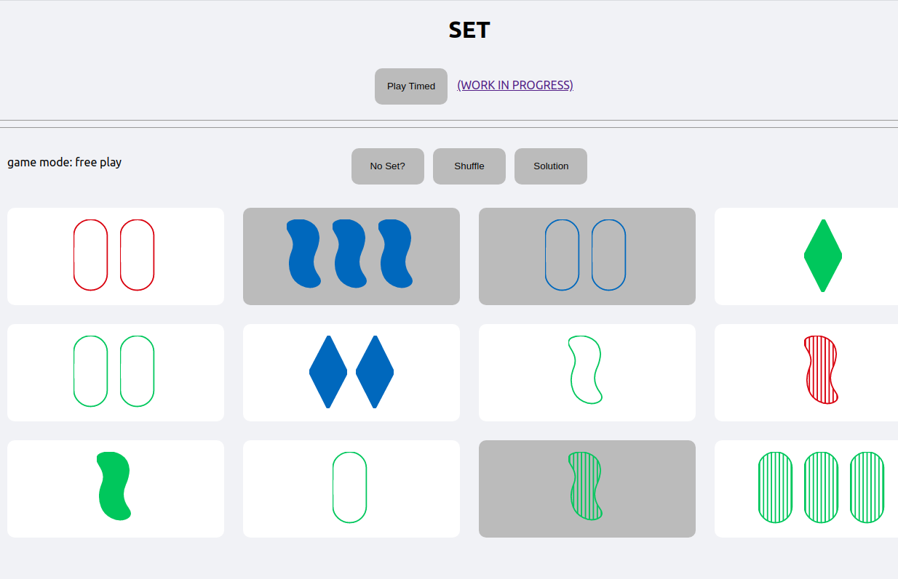

# Set Online

*readme last edited: 5/06/2020*

**This is a work in progress. Feel free to submit a PR ;)**

## Instructions

1. clone this repo
2. `npm start`
3. go to `localhost:3000`
4. contribute!

## How to play?

This is currently just a basic implementation of the game Set. You should look up instructions on what a "set" is / how to play.

To play, select 3 cards, and if they make up a set then they will disappear and be replaced by 3 more cards from the deck. Pressing "Solution" will rotate you through the solutions if they exist. Pressing "No set" will add 3 more cards to your deck.

There are two modes: free play and timed.
The differences are that in timed, we keep track of your score and there's a 3 minute timer to get as high a score as possible. No checking for the solutions in this mode!

## Planned features
*listed in no particular order*
- high score board
- multiplayer rooms
- name submission filtering (no weird strings)
- countdown to game start for timed mode
- better colors for the buttons
- svg string labelling (instead of "Asset 1") and also reuse classnames for svg
- timer in free play as well, but no score submissions.
- how-to-play page/modal
- database security!
- domain
For multiplayer support:
- landing page (to choose to create custom multiplayer room, or to play single player)
- ranking for multiplayer
- random multiplayer rooms? (like generals.io)

oh my goodness this is scary

## Acknowledgements

Thanks to Brent for helping me a lot, Cherry for helping me fix the UI (see screenshots 2 and 3 in the assets folder for what it used to look like), Myron for some advice, and Steven for the inspiration and motivation to create this game!

